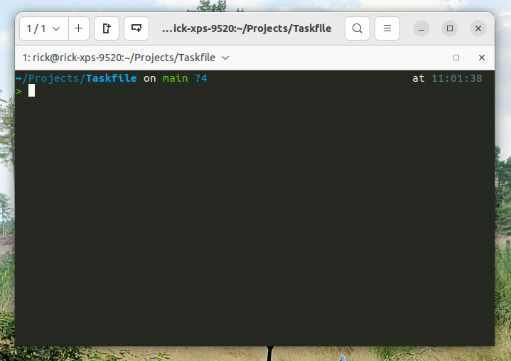

# Taskfile

A `./Taskfile` is a task runner in plain and easy [Bash](https://nl.wikipedia.org/wiki/Bash). It adds a list of available tasks to your project.

## Why

- Works on any OS (any bash terminal)
- A uniform way to run your projects
- Very easy to use
- Automate your most common tasks (updating, starting, building, etc...)
- Easy to understand and maintain

# Create your own taskfile

This project gives you a `Taskfile` base, and gives you a collection of usefull tasks to help out on your project.

- [The Taskfile base](./taskfile-base.md)

We strongly recommend that your project uses a project section containing a `init` and a `update` task. Check out our
example:

- [Project section](./section/project.md)

## Usefull tasks

Check out the following sections for tasks that could be helpfull for your project's Taskfile:

- [Docker](./section/docker.md)
- [GitHub](./section/github.md)
- [GitLab](./section/gitlab.md)

# Credits

This Taskfile setup is based on [Adrian Cooney's Taskfile setup](https://github.com/adriancooney/Taskfile) and
[Enrise](https://enrise.com) their internal implementation of the Taskfile.

# Contribute

Feel free to add your own Taskfile tasks via a PR. The more usefull tasks, the easier we make the life of other
developers.
