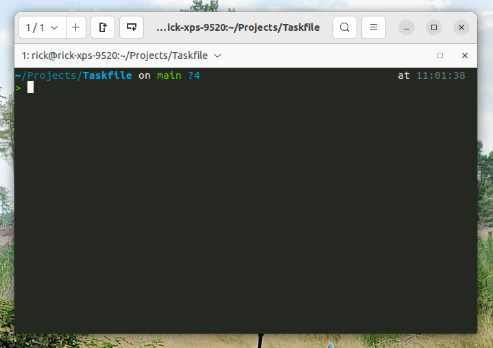

# Taskfile

A Taskfile adds a list of commonly used tasks in a quick overview in your CLI. Enable your users to quickly setup a
project and run common tasks via super simple commands.

## Create your own taskfile

This project gives you a `Taskfile` base, and gives you a collection of usefull tasks to help out on your project.

Check [the full documentation](https://github.com/rick-nu/Taskfile).

## Credits

This Taskfile setup is based on [Adrian Cooney's Taskfile setup](https://github.com/adriancooney/Taskfile) and
[Enrise](https://enrise.com) their internal implementation of the Taskfile.

## Contribute

Feel free to add your own Taskfile tasks via a PR. The more usefull tasks, the easier we make the life of other
developers.
